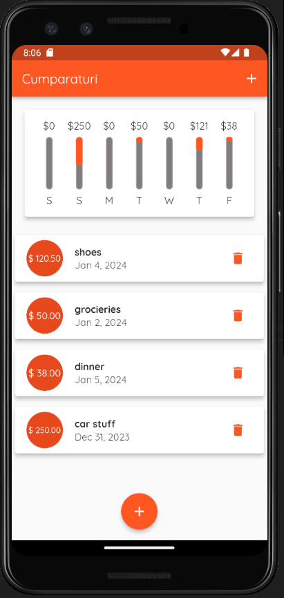
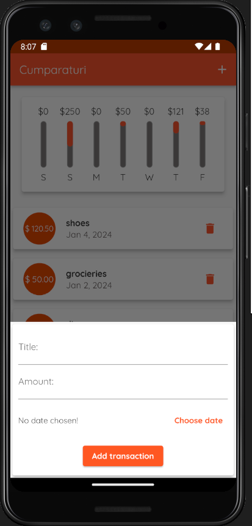
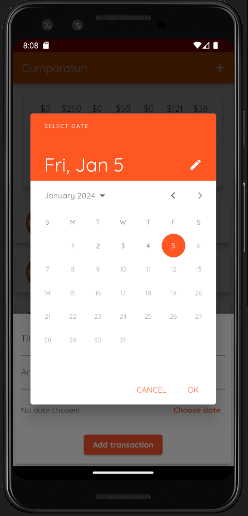

# Expanses Tracker

## Overview

Expanses Tracker is a Flutter-based to-do list application designed to help you manage and visualize your expenses over the past week. With an intuitive interface, this app enables users to efficiently track their expenditures and view them in a graphical representation.

## Visual representation

## Installation and Usage Instructions (For End-Users)

To get started with Expanses Tracker, follow these steps:

1. Clone the repository to your local machine.

2. Navigate to the project directory.

3. Install dependencies.

4. Run the application.

Now, you can start using Expanses Tracker to manage your to-do list and visualize your expenses.

## Contributor Expectations

We welcome contributions to enhance Expanses Tracker. Before contributing, please adhere to the following guidelines:

- Create an issue in the issue queue before making significant changes.
- Follow the provided pull request template.
- Ensure your commits are well-documented and follow the established coding standards.
- Squash commits for clarity and maintainability.

Thank you for considering contributing to Expanses Tracker!
